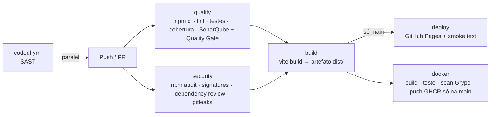

# 🍽️ Sabor Local — Guia de Restaurantes

[](https://github.com/MP-David/sabor-local/actions/workflows/ci-cd.yml)
[](https://github.com/MP-David/sabor-local/actions/workflows/codeql.yml)
[](https://github.com/MP-David/sabor-local/actions/workflows/monitor.yml)
[](https://sonarcloud.io/summary/new_code?id=MP-David_sabor-local)
[](https://sonarcloud.io/summary/new_code?id=MP-David_sabor-local)

**Aplicação publicada:** https://mp-david.github.io/sabor-local/
**Imagem Docker:** `ghcr.io/mp-david/sabor-local:latest`

---

## 1. Sobre o projeto

O **Sabor Local** é uma *Single Page Application* (SPA) feita em React para o trabalho final da disciplina de **Integração Contínua**.

A aplicação é simples de propósito. O foco do trabalho é o **processo** que a cerca: cada alteração passa automaticamente por lint, testes, cobertura, análise estática, verificações de segurança, build, deploy e monitoramento.

```
Código → Git → Pipeline → Testes → Qualidade → Segurança → Build → Deploy → Aplicação → Monitoramento
```

## 2. Serviço proposto

Um **guia de restaurantes** em que o visitante encontra onde comer por categoria, bairro, faixa de preço e nota, e salva seus lugares favoritos.

**Modelo de monetização (previsto, não implementado):**

- banner patrocinado no topo da lista (728×90);
- anúncio nativo intercalado na grade a cada 6 restaurantes;
- anúncio lateral na página de detalhes (300×250);
- **destaque patrocinado**: restaurantes pagantes aparecem primeiro na ordenação "Relevância", com o selo *Patrocinado*.

> Os dados são fictícios e ficam em um módulo JavaScript (`src/data/restaurants.js`). Não há backend.

## 3. Funcionalidades

| Funcionalidade | Descrição |
|---|---|
| Busca textual | Por nome, prato, bairro, descrição ou tag, sem diferenciar acentos nem maiúsculas |
| Filtros | Categoria, bairro, preço máximo ($–$$$$) e nota mínima |
| Ordenação | Relevância (patrocinados primeiro), nota, nº de avaliações, preço e nome |
| Detalhes | Página por restaurante com pratos, endereço, horário e restaurantes parecidos |
| Favoritos | Marcar/desmarcar com ♡, salvos no `localStorage` |
| Rotas | `#/`, `#/restaurante/:id`, `#/favoritos`, `#/sobre` e página 404 |
| Espaços de anúncio | Banner, anúncio nativo e lateral |
| Responsivo | Funciona em celular e desktop |
| Health check | `/health.json` e `/build-info.json` para o monitoramento |

## 4. Tecnologias utilizadas

| Área | Ferramenta | Por quê |
|---|---|---|
| Interface | **React 19** | Componentização e ecossistema maduro |
| Build | **Vite 8** | Build rápido; gera `dist/` estático |
| Testes | **Vitest** + **Testing Library** + jsdom | Integração nativa com o Vite; testes que simulam o usuário |
| Cobertura | **@vitest/coverage-v8** | Relatório LCOV para o Sonar e limite mínimo |
| Lint | **ESLint 10** (flat config) | Padronização e detecção de erros |
| Análise estática | **SonarQube Cloud** | Bugs, *code smells*, duplicação e Quality Gate |
| SAST | **GitHub CodeQL** | Vulnerabilidades no código-fonte |
| Dependências | **npm audit**, **npm audit signatures**, **Dependency Review**, **Dependabot** | Vulnerabilidades e integridade da cadeia de suprimentos |
| Segredos | **Gitleaks** + Secret Scanning/Push Protection do GitHub | Impedir credenciais no repositório |
| CI/CD | **GitHub Actions** | Integrado ao repositório e gratuito para repositórios públicos |
| Deploy | **GitHub Pages** | Hospedagem estática gratuita, deploy via Actions |
| Container | **Docker** (nginx-unprivileged) + **GHCR** + **Grype** | Bônus: imagem enxuta, sem root, escaneada |

## 5. Arquitetura da aplicação

```
src/
├── main.jsx                 # ponto de entrada (monta o React)
├── App.jsx                  # layout + escolha da página pela rota
├── data/restaurants.js      # dados fictícios (mock)
├── utils/                   # regras de negócio PURAS (sem React) → fáceis de testar
│   ├── restaurants.js       #   filtro, ordenação, formatação, estatísticas
│   ├── favorites.js         #   leitura/escrita segura no localStorage
│   ├── router.js            #   roteamento por hash
│   └── version.js           #   versão injetada no build
├── hooks/                   # useHashRoute, useFavorites
├── components/              # Header, Filters, RestaurantCard, RestaurantList, AdSlot, ...
├── pages/                   # HomePage, DetailPage, FavoritesPage, AboutPage, NotFoundPage
└── test/setup.js            # configuração dos testes
```

**Decisões:**

- **Roteamento por hash** (`#/rota`): funciona em hospedagem estática (GitHub Pages, nginx) sem regra de *fallback* no servidor.
- **`base: './'`** no Vite: o **mesmo artefato** roda no GitHub Pages (`/sabor-local/`) e no container (`/`).
- **Lógica separada da interface**: as regras ficam em `utils/` como funções puras, o que deixa a cobertura alta e os testes simples.

## 6. Estratégia de branches e versionamento

Usamos um **Git Flow simplificado**:

```
feature/*  ──PR──▶  develop  ──PR (release)──▶  main  ──▶  deploy em produção
                       ▲                          │
                       └──────── hotfix/* ────────┘
```

| Branch | Papel | Proteções |
|---|---|---|
| `main` | Produção. Todo push gera deploy no GitHub Pages e imagem no GHCR | Só recebe PR; exige o pipeline verde |
| `develop` | Integração. Valida tudo (testes, qualidade, segurança, build), **sem** deploy | Só recebe PR |
| `feature/<nome>` | Uma funcionalidade ou etapa do processo | Abre PR para `develop` |
| `hotfix/<nome>` | Correção urgente em produção | PR para `main` e depois para `develop` |

- **Commits** seguem o [Conventional Commits](https://www.conventionalcommits.org/pt-br/): `feat:`, `fix:`, `ci:`, `test:`, `docs:`, `chore:`.
- **Pull Requests** usam o template em `.github/pull_request_template.md`. O pipeline roda em todo PR e o merge só acontece com os checks verdes.
- **Versionamento semântico** (SemVer `MAJOR.MINOR.PATCH`): a versão fica no `package.json`, aparece no rodapé da aplicação e no `build-info.json`, e cada release em `main` recebe uma **tag** (`v1.0.0`) e uma **GitHub Release**.

**Histórico do projeto:**

| PR | Branch | Conteúdo |
|---|---|---|
| #1 | `feature/spa-guia-restaurantes` | SPA, testes e configuração de lint |
| #2 | `feature/pipeline-ci-qualidade` | Pipeline CI com lint, testes, cobertura e SonarQube |
| #3 | `feature/seguranca` | CodeQL, Gitleaks, npm audit, Dependency Review e Dependabot |
| #4 | `feature/deploy-docker-monitoramento` | Build/artefato, deploy no Pages, Docker e monitoramento |
| #5 | `develop → main` | Release **v1.0.0** |

## 7. Pipeline CI/CD

Arquivo: [`.github/workflows/ci-cd.yml`](.github/workflows/ci-cd.yml). Roda em **push** e **pull request** para `main` e `develop`, e também manualmente (`workflow_dispatch`).



| Job | Etapas | Interrompe o pipeline quando… |
|---|---|---|
| **quality** | `npm ci` → `npm run lint` → `npm run coverage` → SonarQube Scan | há erro de lint, algum teste falha, a cobertura fica abaixo do mínimo ou o **Quality Gate reprova** |
| **security** | `npm audit --audit-level=high` → `npm audit signatures` → Dependency Review (PRs) → Gitleaks | há vulnerabilidade alta/crítica, assinatura inválida ou segredo no histórico |
| **build** | `npm ci` → `npm run build` → `build-info.json` → upload do artefato | o build falha. **Só roda se `quality` e `security` passarem** |
| **deploy** | `actions/deploy-pages` → smoke test com `curl` | o site publicado não responde. **Só na `main`** |
| **docker** | build → teste do container → scan Grype → push no GHCR | o container não sobe ou a imagem tem vulnerabilidade crítica corrigível |

Outras boas práticas aplicadas:

- **`permissions` mínimas** por job (o padrão é `contents: read`).
- **`concurrency`** cancela execuções antigas da mesma branch.
- **Cache do npm** e **`npm ci`** (instalação reprodutível a partir do `package-lock.json`).
- Versões das dependências **fixadas** (`--save-exact`).

## 8. Testes automatizados

```bash
npm test          # roda os testes
npm run coverage  # testes + relatório de cobertura (coverage/)
```

- **Unitários** (`src/utils/*.test.js`): filtro, ordenação, desempates, formatação, favoritos (incluindo `localStorage` corrompido ou bloqueado) e roteador.
- **Integração/componentes** (`src/App.test.jsx`): simulam o usuário com Testing Library. Buscar, filtrar, ordenar, favoritar, navegar para detalhes, 404 e página "Sobre".
- **45 testes**, com cobertura de **~100% de linhas**.
- **Critério automatizado**: o `vite.config.js` define limites mínimos (linhas/funções/instruções ≥ 80%, branches ≥ 75%). Se a cobertura cair abaixo disso, `npm run coverage` falha e o **pipeline para**.
- O relatório fica disponível como artefato `coverage-report` em cada execução e é enviado ao SonarQube em formato LCOV.

## 9. Qualidade de código

- **ESLint** (`eslint.config.js`): regras recomendadas + React Hooks + `no-console`, `eqeqeq`, `no-unused-vars` e `prefer-const` como **erro**.
- **SonarQube Cloud** (`sonar-project.properties`): análise de bugs, *code smells*, duplicação, *security hotspots* e cobertura.
- **Quality Gate bloqueante**: o scan usa `-Dsonar.qualitygate.wait=true`. Se o Quality Gate (*Sonar way*) reprovar, o job `quality` falha e **nada é publicado**.
- A *Automatic Analysis* do SonarQube Cloud fica **desativada**, porque a análise é feita pelo pipeline (CI-based).

## 10. Segurança

| Mecanismo | Ferramenta | Onde | Justificativa |
|---|---|---|---|
| **Análise de dependências** | `npm audit --audit-level=high` | job `security` | Nativo do npm, sem custo; bloqueia vulnerabilidades altas e críticas conhecidas |
| **Integridade (supply chain)** | `npm audit signatures` | job `security` | Confere as assinaturas e atestações de proveniência dos pacotes no registro npm |
| **Novas dependências em PR** | Dependency Review Action | job `security` (PRs) | Barra o PR que introduz pacote vulnerável antes do merge |
| **Atualizações automáticas** | Dependabot | `.github/dependabot.yml` | PRs semanais para npm, GitHub Actions e imagem Docker |
| **SAST** | **CodeQL** (`security-and-quality`) | `codeql.yml` + agenda semanal | Ferramenta oficial do GitHub; os alertas aparecem na aba *Security* |
| **Secret scanning** | **Gitleaks** (histórico completo) + Secret Scanning e Push Protection do GitHub | job `security` + configurações do repo | Detecta chaves e tokens no código e no histórico; o *push protection* bloqueia o push |
| **Segurança da imagem** | **Grype** | job `docker` | Escaneia o container; imagem `nginx-unprivileged` (sem root) e cabeçalhos de segurança no nginx |
| **Secrets e variáveis** | GitHub Secrets | `SONAR_TOKEN` | O token **nunca** fica no código nem no YAML; o `GITHUB_TOKEN` tem permissões mínimas por job |

> ✅ Não há credenciais no código-fonte. O `.gitignore` bloqueia arquivos `.env*`, e o Gitleaks verifica isso a cada execução.

**Secrets usados:**

| Nome | Tipo | Uso |
|---|---|---|
| `SONAR_TOKEN` | Repository secret | Autenticar o scan no SonarQube Cloud |
| `GITHUB_TOKEN` | Automático | Gitleaks, deploy no Pages, push da imagem no GHCR e issues do monitoramento |

## 11. Build e artefatos

**Como o build é feito:** `npm run build` executa o **Vite**, que transpila o JSX, empacota e minifica o JavaScript e o CSS e gera arquivos com *hash* no nome (cache seguro).

**O artefato (`dist/`):**

```
dist/
├── index.html            # página única da SPA
├── assets/index-<hash>.js   # React + aplicação, minificado (~75 kB gzip)
├── assets/index-<hash>.css  # estilos
├── favicon.svg
├── health.json           # usado pelo monitoramento
└── build-info.json       # versão, commit, branch, nº da execução e data do build
```

**Em que etapa:** no job **`build`**, que só roda depois de `quality` e `security` passarem.

**Como é usado:**

1. É publicado como artefato **`sabor-local-dist`** (download na página da execução, guardado por 30 dias).
2. Na `main`, o **mesmo conteúdo** é empacotado com `upload-pages-artifact` e publicado pelo job `deploy`. Não há rebuild no deploy, então o que foi testado é o que vai para produção.
3. O `Dockerfile` gera a mesma pasta `dist/` em um build multi-stage e a serve com nginx.

## 12. Deploy

- **Onde:** GitHub Pages. **URL:** https://mp-david.github.io/sabor-local/
- **Quando:** automaticamente a cada push/merge na **`main`**, pelo job `deploy` (ambiente `github-pages`).
- **Como:** `actions/deploy-pages` publica o artefato do build. Em seguida, um **smoke test** acessa a URL, confere o conteúdo e lê o `build-info.json`. Se falhar, o pipeline fica vermelho.
- **Rollback:** reverter o commit na `main` (ou rodar novamente um workflow antigo) republica a versão anterior.

Configuração única no repositório: **Settings → Pages → Source: GitHub Actions**.

## 13. Monitoramento e observabilidade

Arquivo: [`.github/workflows/monitor.yml`](.github/workflows/monitor.yml)

```
GitHub Actions (cron a cada 30 min) → https://mp-david.github.io/sabor-local/ → Health Check → ✅ Sucesso / ❌ Falha + Issue
```

**Separação de responsabilidades:**

- **CI/CD** verifica se uma *nova versão* pode ser validada e entregue.
- **Monitoramento** verifica se a *versão já publicada* continua disponível.

**O que o workflow faz:**

1. Roda **a cada 30 minutos** (`schedule`) ou manualmente (`workflow_dispatch`).
2. Acessa a URL pública e o `/health.json`.
3. Considera a aplicação **disponível** quando: HTTP **200**, a página contém **"Sabor Local"** e o `health.json` contém `"ok"`.
4. Faz **3 tentativas** com intervalo de 20 s antes de declarar falha, para evitar alarme falso.
5. Registra no **resumo da execução** (Job Summary) a URL, o código HTTP, o tempo de resposta e o resultado.
6. Se estiver **indisponível**: a execução fica vermelha ❌ e uma **GitHub Issue** "🚨 Aplicação indisponível" é aberta (ou comentada, se já existir).
7. Quando a aplicação **volta**, a issue é **fechada automaticamente** com um comentário.

O histórico de todas as verificações fica na aba **Actions → Monitoramento**.

## 14. Docker (bônus)

- **`Dockerfile` multi-stage**: `node:22-alpine` faz o build e `nginxinc/nginx-unprivileged` serve o `dist/` na porta **8080**, **sem root**.
- **`nginx.conf`**: cache longo para `/assets`, *fallback* para `index.html` e cabeçalhos de segurança.
- **`HEALTHCHECK`** consulta `/health.json`.
- **No pipeline** (job `docker`): build com cache → sobe o container e testa com `curl` → **scan com Grype** (falha em vulnerabilidade crítica corrigível) → **push para o GHCR** na `main` (tags `latest`, `sha-<commit>` e o nome da branch).

Rodar localmente:

```bash
# usando a imagem publicada
docker run --rm -p 8080:8080 ghcr.io/mp-david/sabor-local:latest

# ou construindo a partir do código
docker build -t sabor-local .
docker run --rm -p 8080:8080 sabor-local
# abrir http://localhost:8080
```

## 15. Evidências

| Evidência | Imagem |
|---|---|
| Pipeline CI/CD completo (todos os jobs verdes) |  |
| Pull Requests e branches |  |
| Testes e cobertura no pipeline |  |
| SonarQube Cloud: Quality Gate |  |
| Segurança: CodeQL, Gitleaks e npm audit |  |
| Artefato do build |  |
| Deploy no GitHub Pages |  |
| Monitoramento (execução agendada) |  |
| Imagem no GHCR (Docker) |  |
| Aplicação publicada |  |

**Vídeo de apresentação:** _(link do vídeo)_

---

### Como rodar localmente

```bash
git clone https://github.com/MP-David/sabor-local.git
cd sabor-local
npm ci
npm run dev        # http://localhost:5173
npm run lint
npm run coverage
npm run build && npm run preview
```
